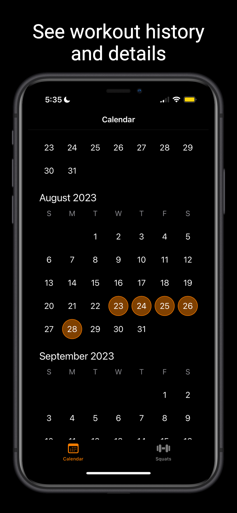
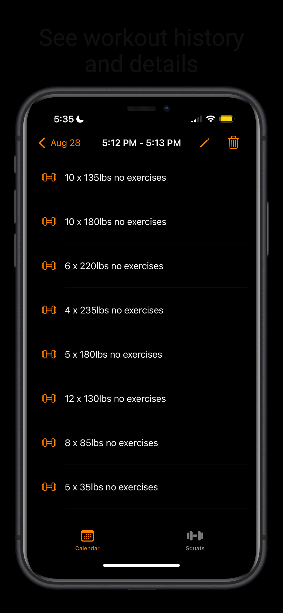

<h1 align="center"> Squatify </h1>  

  

  Track squats with your smart camera.

  

## Introduction

This is the public repo for Squatify, an iOS fitness tracker tailored to squats. It uses an iOS device's camera to provide a hands-free experience for counting reps, tracking sets, and timing rest intervals. It also allows users to visualise their workout history. The intention is to also provide form correction in the next major release, however this part of the project will be kept private since at some point I might try to monetize it!

  
  
  

- 🎥 **Camera-Assisted Tracking**: Position your device upright, and Squatify will automatically count your squats.
- ⏱ **Auto Rest Timer**: After each set, the rest timer kicks in automatically.
- 🎯 **Dynamic Adjustments**: Modify your rep target, set goal, rest interval, and add weight on-the-fly.
- 📅 **Detailed Workout History**: Keep an eye on your progress with a calendar-based workout history and detailed exercise metrics.
- 💪 **Motivation & Progress**: Visualize your achievements and stay motivated.

Squatify uses state-of-the-art pose estimation software. Since this is a fast moving field the software used in Squatify is likely to change - especially as Apple improves the models in its VisionOS. Please get in contact if you wish to collaborate (:

